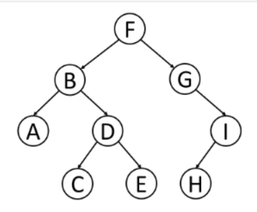

## 树

### 结构
```
// binary tree node
function TreeNode(val, left, right) {
  this.val = (val===undefined ? 0 : val)
  this.left = (left===undefined ? null : left)
  this.right = (right===undefined ? null : right)
}
```

### 基本概念
* 树的高度：根节点到叶子节点的最大值
* 树的深度：高度和深度相反，高度是从下往上数，深度是从上往下。根节点的深度是0，叶子节点的高度是0
* 树的层：根开始定义，根为第一层，根的孩子为第二层...
* 二叉树，三叉树...N叉树：由其子节点最多可以有几个决定，最多有N个就是N叉树

### 二叉树
每个节点最多只有两个节点，习惯称之为左节点和右节点

分类
* 完全二叉树
* 满二叉树
* 二叉搜索树
* 平衡二叉树
* 红黑树
* ...

表示
* 链表存储
* 数组存储（非常适合完全二叉树）

遍历
* 前序遍历
* 中序遍历
* 后序遍历
* 层序遍历（BFS）



前序遍历（DFS）
* 访问当前节点
* 遍历左子树
* 遍历右子树
```
// 递归
const preorder = (root) => {
  if (!root) return;
  console.log(root.val);
  preorder(root.left);
  preorder(root.right);
};

// FBADCEGIH
```
```
// 迭代，使用颜色标记节点状态，新节点为white, 未访问的节点为gray
// 白色入栈，灰色将值输出
// 入栈顺序为遍历顺序的反向，先序，中左右 -> 右左中
const preorderTraversal = (root) => {
  let white = 0, gray = 1;
  let stack = [{color: white, node: root}];
  while (stack.length > 0) {
    const {color, node} = stack.pop();
    if (!node) continue;
    if (color === white) {
      stack.push({color: white, node: node.right});
      stack.push({color: white, node: node.left});
      stack.push({color: gray, node: node});
    } else {
      console.log(node.val)
    }
  }
};
```

中序遍历
* 遍历左子树
* 访问当前节点
* 遍历右子树
```
// 递归
const inorder = (root) => {
  if (!root) return;
  inorder(root.left);
  console.log(root.val);
  inorder(root.right);
};

// ABCDEFGHI
```
```
// 迭代，入栈顺序 左中右 -> 右中左
const inorderTraversal = (root) => {
  let white = 0, gray = 1;
  let stack = [{color: white, node: root}];
  while (stack.length > 0) {
    const {color, node} = stack.pop();
    if (!node) continue;
    if (color === white) {
      stack.push({color: white, node: node.right});
      stack.push({color: gray, node: node});
      stack.push({color: white, node: node.left});
    } else {
      console.log(node.val)
    }
  }
};
```

后续遍历
* 遍历左子树
* 遍历右子树
* 访问当前节点
```
// 递归
const postorder = (root) => {
  if (!root) return;
  postorder(root.left);
  postorder(root.right);
  console.log(root.val);
};

// ACEDBHIGF
```
```
// 迭代，入栈顺序，左右中 -> 中右左
const postorderTraversal = (root) => {
  let white = 0, gray = 1;
  let stack = [{color: white, node: root}];
  while (stack.length > 0) {
    const {color, node} = stack.pop();
    if (!node) continue;
    if (color === white) {
      stack.push({color: gray, node: node});
      stack.push({color: white, node: node.right});
      stack.push({color: white, node: node.left});
    } else {
      console.log(node.val)
    }
  }
};
```

层序遍历（BFS）
* 先遍历树的第一层，再遍历树的第二层，以此类推
* 可使用DFS并记录当前访问层级的方式实现
* 更多时候使用队列的先进先出特性实现
* 比较适合找 *最短路径/距离* 和 *某一个距离的目标*
```
// 记录当前访问层级
const bfs = (root) => {
  let currentLevel = [root];
  while(currentLevel.length > 0) {
    let nextLevel = [];
    for (let i = 0; i < currentLevel.length; i++) {
      console.log(currentLevel[i].val);
      if (currentLevel[i].left) nextLevel.push(currentLevel[i].left);
      if (currentLevel[i].right) nextLevel.push(currentLevel[i].right);
    }
    currentLevel = nextLevel;
  }
};
```
```
// 队列先进先出
const bfs = (root) => {
  const q = [root];
  while (q.length > 0) {
    const n = q.shift();
    console.log(n.val);
    if (n.left) q.push(n.left);
    if (n.right) q.push(n.right)
  }
};

// FBGADICEH
```

### 二叉树构建
中序序列和前、后、层次序列任意组合唯一确定一颗二叉树（前提是遍历基于引用或者二叉树的值都不相同）
* 前、后、层次序列提供根节点的信息
* 中序序列用于区分左右子树

本质
* 确定根节点
* 确定左子树
* 确定右子树

eg. 105 从前序遍历和中序遍历构建二叉树

preorder = [3,9,20,15,7]

inorder = [9,3,15,20,7]

思路
* 前序遍历顺序是根左右，所以preorder中第一个数3肯定是根节点
* 中序遍历顺序是左根右，已知根节点是3，可知inorder[0]是左子树，inorder[2,4]是右子树。
* 继续遍历preorder，左子树只有一个，9，往下走，20属于右子树第一个，是右子树根节点
* 以此类推...

题目：105，106，889
 
 ### 二叉搜索树
 二叉树的一种，具有以下性质
 * 左子树的所有节点值小于根的节点值
 * 右子树的所有节点值大于根的节点值
 
 *二叉搜索树的中序遍历结果是一个有序列表*
 
 二叉搜索树题目：1008，94，98，173，250

### 树的直径（diameters）
* 二叉树的直径：dfs遍历，返回左右子树的深度，取最大值；return Math.max(left, right) + 1; lc543
* N叉树(N-Ary tree)的直径，跟二叉树一个思路，dfs求出每一个分叉的深度，取最大的两个，相加就是直径。lc1522
 
 ## 堆
 堆可以被看作近似的完全二叉树，通常以数组形式存储
* 所有的节点都大于等于（最大堆）或小于等于（最小堆）它的子节点
* 表示堆的数组A中，若A[1]为根节点
* 给定任意节点i，其父子节点分别为
* 父节点：Math.floor(i / 2)
* 左子节点：2 * i
* 右子节点：2 * i + 1

应用
* 堆排序
* top K问题
* 共享计算机系统的作业调度（优先队列）等

待续...

## 递归
方法或者函数调用自身的方式成为递归调用。调用称之为*递*，返回称为*归*

* 有意义的递归算法会把问题分解成规模缩小的同类子问题
* 当子问题缩减到寻常的时候，就可以知道它的解
* 然后建立递归函数之间的联系即可解决原问题
* 必须要有递归的终止条件（算法的有穷性）
* 计算空间复杂度时要考虑到递归栈的空间复杂度

